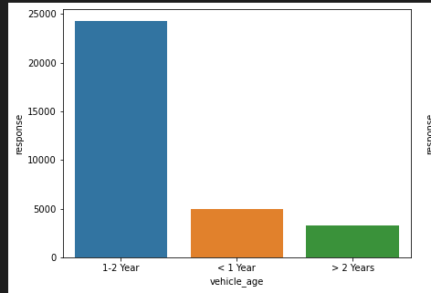
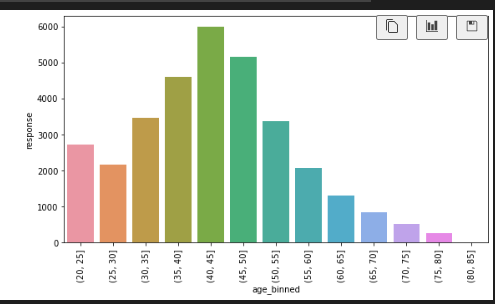
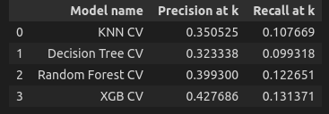
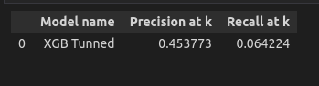
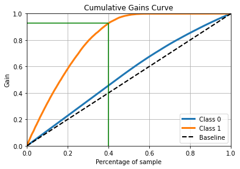
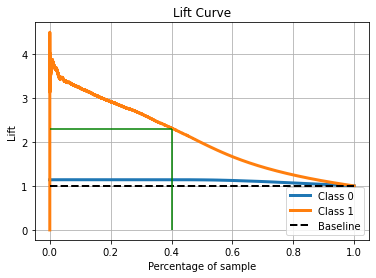

# Health Insurance Cross-Sell

## This project aims to order a potential client list by propensity score

#### This project was made by {Alexandre Rodrigues}.

# 1. Problema de negócio.

'O Contexto a seguir, é completamente fictício.

A Insurance All é uma empresa que fornece seguro de saúde para seus clientes e o time de produtos está analisando a possibilidade de oferecer aos assegurados, um novo produto: um seguro de automóveis.

Assim como o seguro de saúde, os clientes desse novo plano de seguro precisam pagar um valor anualmente à Insurance All para obter um valor assegurado pela empresa, destinado aos custos de um eventual acidente ou dano ao veículo.

Com a solução, o time de vendas espera conseguir priorizar as pessoas com maior interesse no novo produto e assim, otimizar a campanha realizando apenas contatos aos clientes mais propensos a realizar a compra.

# 3. Planejamento da solução

As estratatégias utilizadas para resolver o problema foram:

**1. Data Description:**

**2 Feature Engineering:**

**3. Data Filtering:**

**4. Exploratory Data Analysis:**

**5. Data Preparation:**

**6. Feature Selection:**

**7. Machine Learning Modelling:**

**8. Hyperparameter Fine Tunning:**

**9. Convert Model Performance to Business Values:**

**10. Deploy Modelo to Production:**

# 4. Top 3 Insights

**Hipótese 01: Clientes com carros com menos de um ano contratam o seguro veicular.** 

**Falsa.**

Aproximadamente 74% das pessoas que contratariam o seguro tem o carro de 1 a 2 anos.

**Hipótese 02: Pessoas com idade acima de 30 anos contratam o seguro veicular**

**Verdadeira.**

85% das pessoas que contratam o seguro veicular tem idade acima de 30 anos.

# 5. Machine Learning Model Applied

Os modelos utilizados no primeiro ciclo do CRISP-DS foram:

a) KNN
b) Decision Tree
c) Random Forest Classifier
d) XGB Classifier

# 6. Machine Learning Modelo Performance
Através de técnicas como cros validation e Fine tuning foi possível identificar que o modelo XGB foi o que obteve melhor performance dentre os demais. A métrica utilizada para comparar a performance dos modelos foi a precision@k.

A precision @k neste projeto indica a porcentagem de pessoas até uma determinada posição em uma lista que tem a maior probabilidade de contratar o seguro veicular. A figura abaixo compara está métrica em diferentes modelos utilizando o cross validation.

Após escolher o modelo final e aplicar o fine tuning para escolher os melhores parâmetros o resultado final do modelo pode ser visto abaixo. 

# 7. Business Results

Para traduzir o resultado do modelo em resultado de negócios foi utilizado a curva de ganho acumulado. A curva de ganho acumulado explica que ao direcionar uma campanha de marketing para 40% das pessoas da minha base de dados eu teria 93% de respostas positivas.

Além disso, podemos notar na curva de lift que ao utilizar o modelo para selecionar uma lista com maior probabilidade de respostas positivas eu estaria melhorando meu processo em 2,3x em comparação a uma seleção aleatória.

# 8. Conclusions

- Em uma lista de 40.000 pessoas, a empresa poderia investir para alcançar somente 40% dos clientes com maior probabilidade de contratar o seguro veicular e mesmo assim alcançaria 93% das respostas positivas, ou seja, 37.200 pessoas. E, portanto, poderia guardar 60% dos meus recursos e investir em outras estratégias.
- O modelo utilizado para ordenar a lista com as maiores probabilidades de contratar o seguro tem uma performance 2.3 melhor que uma tomada de decisão aleatória ao utilizar apenas 40% da base de dados.
- Maior parte das pessoas que contratariam o seguro veicular tem idade acima de 30 anos, o que faz sentido se for pensar que pessoas acima desta idade devem ter maior estabilidade financeira.

# 9. Next Steps to Improve
- Aplicar ténicas para balanceamento dos dados
- Utilizar outros métodos de fine tuning
- Utilizar outras técnias para seleção de features
- Testar outros modelos

